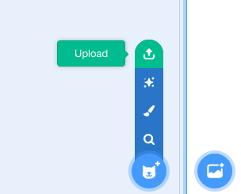
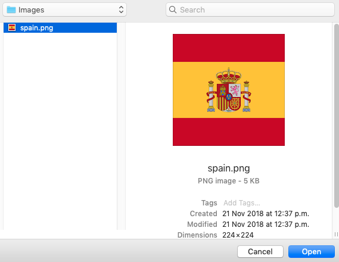

## Drawing sprites

Next you will add flag sprites. Let's start with the English and Spanish flags.

There are no national flags in the library so you will need to download some images of the flags or draw them.

--- task ---
To create a sprite using an image, download an image or use the one found in the resources for this project, hover over the choose a sprite button and click the upload button.

Then find your file, click it and click open.

Your image should appear on the stage. You can resize it using the sprite information panel below the stage.
--- /task ---

--- task ---

To draw a sprite, hover over the choose a sprite button and click the paint button.

You will see the canvas appear.

1. This is where you choose the colour you would like to draw with. For white, set the Saturation to 0 and the Brightness to 100. For black, set the Brightness to 0.
2. This is where you choose the size of the brush.
3. This is where you choose which tool you are using. We will be using the paintbrush as seen in the picture.

Now draw the England flag, it is a white flag with a red cross in the middle. Mine is below.

--- /task ---

Next, let's look at some of the new features in Scratch 3!