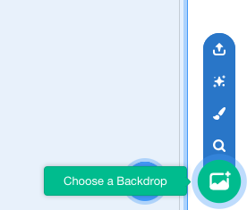
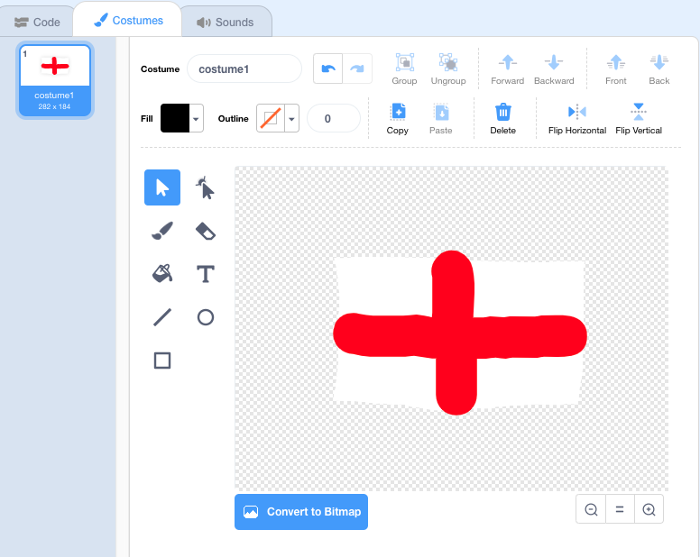

## Draw sprites and a backdrop

In this project, I will be translating from English, my first language, into other languages, so I will be using the English flag. If your first language is available in both the Translate and Text to Speech extensions, you can choose to use this language instead.

--- task ---
To start, open the starter project [online](https://scratch.mit.edu/projects/282154211/){:target="_blank"} or download the [offline version](resources/PhrasebookStarter.sb3){:target="_blank"}.

--- /task ---
--- task ---

Next, create the main backdrop. The first backdrop should contain flags to represent the languages in the phrasebook.

Click on the button in the bottom right-hand corner to open the backdrops library.

Choose a backdrop from the library, or if you want to, you can create your own. I chose Wall 1.

--- /task ---

--- task ---
Next, add a flag sprite. A sprite looking like the Spanish flag is already included in the starter project. Now draw the England flag, or the flag of the country you live in.

The English flag is white with a red cross in the centre, like this one drawn by me:

[[[generic-scratch3-draw-sprite]]]

In the sprite information panel below the Stage, rename your sprite 'england' (or give it your country's name instead).

--- /task ---

Next, we will look at some of the new features of Scratch 3.0!
