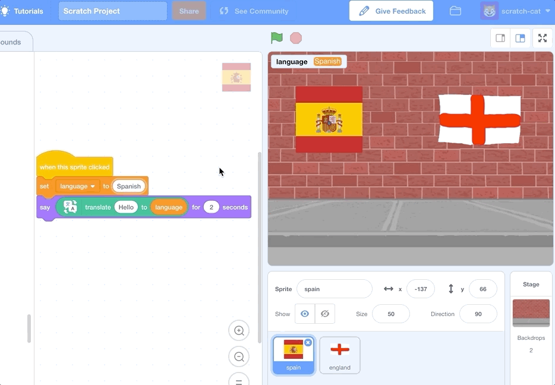

## Google translate

Google translate is a new addition to Scratch 3. To add it to your program, you'll need to select the Google translate extension from the extensions menu.

--- task ---
Click the "Add extension" button on the bottom left corner of the screen as seen below.


Then choose "Translate".


--- /task ---

Now, let's get our flags to say hello in their languages.

--- task ---

Make sure the spain sprite is selected and the code tab is selected.

 

Create a variable `language` to store the selected language and make it available for all sprites.

[[[generic-scratch3-add-variable]]]

Add code to the spain sprite to set `language`{:class="block3data"} to "Spanish" and to `translate`{:class="block3extensions"} "Hello" into our `language`{:class="block3data"} variable and `say`{:class="block3looks"} that when you click it.


```blocks3
when this sprite clicked
set [language v] to [Spanish]
say [\[Hello\] in (language)] for (2) secs :: extension
```
--- /task ---
--- task ---

Now test your code by clicking the spain flag on the stage.



--- /task ---

--- task ---

Now do the same for the england flag sprite.

--- hints ---
--- hint ---
In a similar way to the spain flag sprite, `when the england flag is clicked`{:class="block3events"}, `set the language to English`{:class="block3data"} and `say`{:class="block3looks"} `Hello in`{:class="block3extensions"} the language stored in `language`{:class="block3data"}.

--- /hint ---
--- hint ---
These are the code blocks you need to add to the england flag sprite:
```blocks3
say [ ] for (2) secs

translate [Hello] in (language) :: extension

when this sprite clicked

set [language v] to [English]

```

--- /hint ---
--- hint ---
Here's what your code should look like for the england flag sprite:

```blocks3
when this sprite clicked
set [language v] to [English]
say [\[Hello\] in (language)] for (2) secs :: extension
```

--- /hint ---
--- /hints ---
--- /task ---