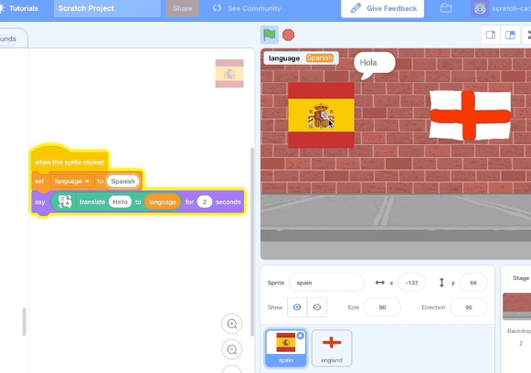

## Google Translate

Scratch 3.0 has a Google Translate tool. You can find the tool in the Extensions menu.

--- task ---
Click on the **Add extension** button in the bottom left-hand corner of the window.


Then click on **Translate**.


--- /task ---

Now make your flags say "hello" in their languages.

--- task ---

Click on the Spanish flag sprite to select it, and then click on the Code tab.

 

Create a variable called `language`{:class="block3variables"}. Make the variable available for all sprites.

[[[generic-scratch3-add-variable]]]

Add code to the Spanish flag sprite so that, when the sprite is clicked:
1. `language`{:class="block3variables"} is set to 'Spanish'
1. "Hello" is `translated`{:class="block3extensions"} into the language stored in the `language`{:class="block3variables"} variable so the sprite can `say`{:class="block3looks"} the translated word


```blocks3
when this sprite clicked
set [language v] to [Spanish]
say (translate [Hello] to (language):: extension) for (2) secs
```
--- /task ---
--- task ---

Test your code by clicking the Spanish flag on the Stage.

--- no-print ---

--- /no-print ---

--- print-only ---

--- /print-only ---

--- /task ---

--- task ---

Now do the same for the England flag sprite (or whichever flag you've added).

--- hints ---
--- hint ---
In a similar way to the code for the Spanish flag sprite, `when the England flag is clicked`{:class="block3events"}, `set the language to English`{:class="block3variables"} and `say`{:class="block3looks"} `Hello in`{:class="block3extensions"} the language stored in `language`{:class="block3variables"}.

--- /hint ---
--- hint ---
These are the code blocks you need to add to the England flag sprite:
```blocks3
say [ ] for (2) secs

translate [Hello] to (language) :: extension

when this sprite clicked

set [language v] to [English]

```

--- /hint ---
--- hint ---
Here's what your code should look like for the England flag sprite:

```blocks3
when this sprite clicked
set [language v] to [English]
say (translate [Hello] to (language):: extension) for (2) secs
```

--- /hint ---
--- /hints ---
--- /task ---
