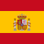
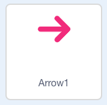

## Switch the backdrop

The backdrop is becoming crowded by the flags, so create a second backdrop on which to place your phrase sprites. When a flag sprite is clicked, the second background should appear and the flag sprites should hide.

--- task ---
Add a new backdrop by clicking the **Choose a backdrop** button, or draw a new backdrop if you want to. You could use the 'Beach Malibu' backdrop that you can see in this guide.
--- /task ---

--- task ---
Add the following code to the Spanish flag sprite:


```blocks3
when this sprite clicked
set [language v] to [Spanish]
say [\[Hello\] in (language)] for (2) secs :: extension
+ switch backdrop to [Beach Malibu v]

when backdrop switches to [Beach Malibu v]
hide
```

--- /task ---
--- task ---
Test the new code. When you clicking on the Spanish flag sprite, the sprite should hide and the new backdrop should appear.
--- /task ---

Now, create a way to swap back to the first backdrop.

--- task ---
First, go to the sprites library and add the sprite called 'Arrow1'.


Change the direction of the arrow to `-90` in the sprite information panel below the Stage.


Then drag the arrow into the top left-hand corner of the Stage.

Add the following code to the arrow sprite:


```blocks3
when this sprite clicked
switch backdrop to [Wall 1 v]

when backdrop switches to [Wall 1 v]
hide

when backdrop switches to [Beach Malibu v]
show
```

When you click on the arrow sprite now, your Scratch project goes back to the first backdrop.

However, you can see that the Spanish flag sprite is not visible!

Add the following code to the Spanish flag sprite to fix this problem.


```blocks3
when backdrop switches to [Wall 1 v]
show
```
--- /task ---
--- task ---
Now you can switch between the two backdrops by clicking on the Spanish flag and on the arrow.

Can you add code so that, when you click on the England flag, the Scratch program also switches to the second backdrop?

--- hints ---
--- hint ---
Just like the in the code for the Spanish flag sprite, you need to `switch backdrop to Beach Malibu`{:class="block3looks"} `when the England flag is clicked`{:class="block3events"}. You also need to `show`{:class="block3looks"} the flag `when the backdrop switches to Wall 1`{:class="block3events"}, and `hide`{:class="block3looks"} the flag `when the backdrop switches to Beach Malibu`{:class="block3events"}.
--- /hint ---
--- hint ---
These are the code blocks you need to add to the England flag sprite:
```blocks3
hide

when backdrop switches to [ v]

show

switch backdrop to [Beach Malibu v]
```
--- /hint ---
--- hint ---
This is what your code should look like for the England flag sprite:


```blocks3
when this sprite clicked
set [language v] to [English]
say [\[Hello\] in (language)] for (2) secs :: extension
+ switch backdrop to [Beach Malibu v]

when backdrop switches to [Beach Malibu v]
hide

when backdrop switches to [Wall 1 v]
show
```
--- /hint ---
--- /hints ---
--- /task ---
--- task ---
Test your code to ensure everything works correctly.

Can you switch between backdrops by clicking on the sprites?

Do the sprites appear and disappear when they should?


--- /task ---
