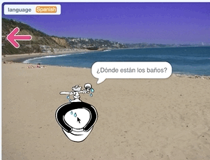

## Text to Speech

Now you'll use another new tool in Scratch 3.0: Text to Speech!

--- task ---
When you are in a country where people speak a different language to you, it is very useful to know the translation for the sentence "Where are the toilets?". You will add a new sprite to trigger this phrase. 

If you want to, you can create the new sprite by drawing a toilet.

[[[generic-scratch3-draw-sprite]]]

Or you can use the image in this project's [resources](https://rpf.io/phrasebook-resources):

--- /task ---

--- task ---
Add code to the toilet sprite to show or hide the sprite when the backdrop switches.

```blocks3
when backdrop switches to [Wall 1 v]
hide

when backdrop switches to [Beach Malibu v]
show
```
--- /task ---
--- task ---
Now add some code to the same sprite to translate the question "Where are the toilets?" into the language that is stored in the `language`{:class="block3variables"} variable. 


```blocks3
when this sprite clicked
say (translate [Where are the toilets?] to (language):: extension) for (2) secs
```
--- /task ---

Next, try out the new Text to Speech tool!

--- task ---

Add the Text to Speech extension in the same way as you added the Google Translate extension.
--- /task ---
--- task ---
First, set the language on our Spanish and England flag sprites.


```blocks3
when this sprite clicked
set [language v] to [Spanish]
+ set language to [Spanish \(European\) v] :: extension
say (translate [Hello] to (language):: extension) for (2) secs
switch backdrop to [Beach Malibu v]
```


```blocks3
when this sprite clicked
set [language v] to [English]
+ set language to [English v] :: extension
say (translate [Hello] to (language):: extension) for (2) secs
switch backdrop to [Beach Malibu v]
```
--- /task ---
--- task ---
Then add this code to the toilet sprite:


```blocks3
when this sprite clicked
speak(translate[Where are the toilets?] to (language)::extension) ::extension
```
--- /task ---
--- task ---
Now test your code.

You should be able to click the Spanish flag to set the language to Spanish, and then click the toilet to see **and hear** how "Where are the toilets?" is said in Spanish. It's "¿Dónde están los baños?". The English flag should work for English too.

--- no-print ---
![An animation showing a brick wall upon which hangs the flag of Spain and the flag of England. A mouse pointer moves to the flag of Spain and clicks on it, causing the variable watcher in the top left to change to read 'Spanish' and a speech bubble to appear with the word 'Hola'. The scene changes to a toilet placed on a beach. When this is clicked, a speech bubble appears including the Spanish translation of 'Where are the toilets?', '¿Dónde están los baños?'. The mouse pointer moves to an arrow at the top left to return back to the wall and the user then clicks on the flag of England. The variable watcher now reads 'English' and the scene moves back to the toilet on the beach, which, when clicked, displays the English text 'Where are the toilets?'](images/textToSpeechTest.gif)
--- /no-print ---

--- print-only ---

--- /print-only ---

--- /task ---
