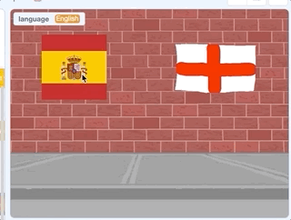

## Text to Speech

Now let's add a sprite to the Beach backdrop and take a look at another new Scratch 3.0 extension, Text to Speech!

--- task ---
"Where are the toilets?" is a phrase that is very important to know when you are in a country that speaks a different language. Let's use a cartoon toilet as a sprite to trigger this phrase. 

Create a new sprite and draw a toilet or click upload and use the image in this project's resources.

[[[generic-scratch3-draw-sprite]]]
--- /task ---

--- task ---
First, add code to the toilet sprite to show and hide the sprite when the backdrop switches.

```blocks3
when backdrop switches to [Wall 1 v]
hide

when backdrop switches to [Beach Malibu v]
show
```
--- /task ---
--- task ---
Next add some code to the same sprite to translate the question "Where are the toilets?" into the language that is stored in the `language`{:class="block3data"} variable. 


```blocks3
when this sprite clicked
say [\[Where are the toilets?\] in (language)] for (2) secs :: extension
```
--- /task ---
--- task ---
Now lets try out the new text to speech extension.
Add the Text to Speech extension in the same way as you added the Google Translate extension.
--- /task ---
--- task ---
First, set the language on our spain and england flag sprites.


```blocks3
when this sprite clicked
set [language v] to [Spanish]
+ set language to [Spanish \(European\) v] :: extension
say [\[Hello\] in (language)] for (2) secs :: extension
switch backdrop to [Beach Malibu v]
```


```blocks3
when this sprite clicked
set [language v] to [English]
+ set language to [English v] :: extension
say [\[Hello\] in (language)] for (2) secs :: extension
switch backdrop to [Beach Malibu v]
```
--- /task ---
--- task ---
Finally add this code to the toilet sprite:


```blocks3
when this sprite clicked
speak(translate(Where are the toilets?) to (language)::extension) ::extension
```
--- /task ---
--- task ---
Now test your code, you should be able to click the spain flag to set the language to Spanish and then click the toilet to see and hear how "Where are the toilets?" is said in Spanish. It's "¿Dónde están los baños?"! The english flag should work for English too, even though it isn't currently translating anything.


When you click on your toilet sprite, you should hear the phrase too!
--- /task ---
