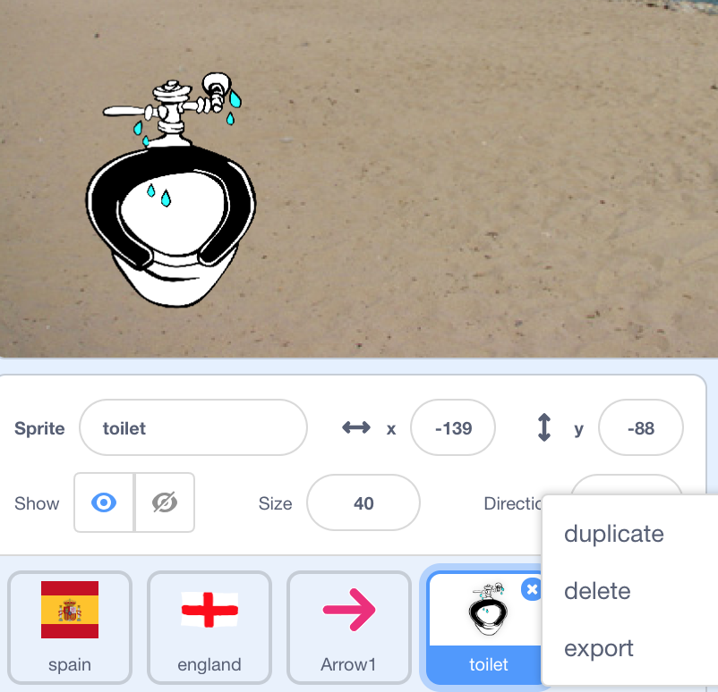

## More phrases

Now we've got one phrase working, excellent! That's not enough for a phrasebook though, is it? Let's add some more phrases.

--- task ---
Let's duplicate our toilet sprite as most of the code will be the same for other phrases. 
Right click on the toilet sprite in the list of sprites under the stage and click duplicate.

--- /task ---
--- task ---
"Yes" and "No" are useful words to know in other languages, let's use the red cross to represent "No". Change the costume of the new sprite to Button5-b by clicking on the new sprite, selecting the Costumes tab (1) and then clicking the Choose a Costume button on the bottom left (2). Then delete the old costume by clicking it's "x" (3).

Change the sprite name in the sprite information panel under the stage to "no".
--- /task ---
--- task ---
Finally, change "Where are the toilets?" to "No" in the no sprite's `translate`{:class="block3extensions"} code blocks. See the changes below:

```blocks3
when this sprite clicked
- say (translate (Where are the toilets?) to (language):: extension) for (2) secs
+ say (translate (No) to (language):: extension) for (2) secs

when this sprite clicked
- speak(translate(Where are the toilets?) to (language)::extension) ::extension
+ speak(translate(No) to (language)::extension) ::extension
```
--- /task ---
--- task --- 
Add some more phrases to your phrasebook. 
Start by adding "Yes" as one of them.

--- hints ---
--- hint ---
First duplicate a sprite with most of the code, then choose a costume and finally change the phrase in that sprite's `translate`{:class="block3extensions"} code blocks.
--- /hint ---
--- hint ---
The code for the new yes sprite looks like this:
```blocks3
when backdrop switches to [Wall 1 v]
hide

when backdrop switches to [Beach Malibu v]
show

when this sprite clicked
say (translate (Yes) to (language):: extension) for (2) secs

when this sprite clicked
speak(translate(Yes) to (language)::extension) ::extension
```
--- /hint ---
--- /hints ---
--- /task ---